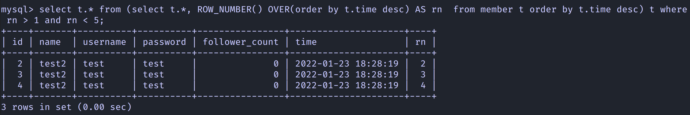
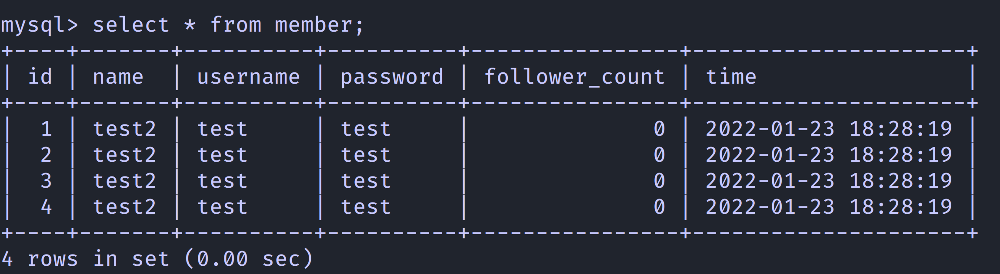

- [How to use](#how-to-use)
- [Assignments](#assignments)
	- [REQ3: SQL CRUD](#req3-sql-crud)
		- [使用 INSERT 指令新增一筆資料到 member 資料表中，這筆資料的 username 和 password 欄位必須是 test。接著繼續新增至少 4 筆隨意的資料](#使用-insert-指令新增一筆資料到-member-資料表中這筆資料的-username-和-password-欄位必須是-test接著繼續新增至少-4-筆隨意的資料)
		- [使用 SELECT 指令取得所有在 member 資料表中的會員資料](#使用-select-指令取得所有在-member-資料表中的會員資料)
		- [使用 SELECT 指令取得所有在 member 資料表中的會員資料，並按照 time 欄位，由近到遠排序](#使用-select-指令取得所有在-member-資料表中的會員資料並按照-time-欄位由近到遠排序)
		- [使用 SELECT 指令取得 member 資料表中第 2 ~ 4 共三筆資料，並按照 time 欄位，由近到遠排序](#使用-select-指令取得-member-資料表中第-2--4-共三筆資料並按照-time-欄位由近到遠排序)
		- [使用 SELECT 指令取得欄位 username 是 test 的會員資料](#使用-select-指令取得欄位-username-是-test-的會員資料)
		- [使用 SELECT 指令取得欄位 username 是 test、且欄位 password 也是 test 的資料](#使用-select-指令取得欄位-username-是-test且欄位-password-也是-test-的資料)
		- [使用 UPDATE 指令更新欄位 username 是 test 的會員資料，將資料中的 name 欄位改成 test2。](#使用-update-指令更新欄位-username-是-test-的會員資料將資料中的-name-欄位改成-test2)
	- [REQ4: SQL Aggregate Functions](#req4-sql-aggregate-functions)
		- [取得 member 資料表中，總共有幾筆資料 ( 幾位會員 )](#取得-member-資料表中總共有幾筆資料--幾位會員-)
		- [取得 member 資料表中，所有會員 follower_count 欄位的總和](#取得-member-資料表中所有會員-follower_count-欄位的總和)
		- [取得 member 資料表中，所有會員 follower_count 欄位的平均數](#取得-member-資料表中所有會員-follower_count-欄位的平均數)
	- [REQ5: SQL JOIN](#req5-sql-join)
		- [在資料庫中，建立新資料表，取名字為 message, 資料表中必須包含以下欄位設定](#在資料庫中建立新資料表取名字為-message-資料表中必須包含以下欄位設定)
		- [使用 SELECT 搭配 JOIN 語法，取得所有留言，結果須包含留言者會員的姓名](#使用-select-搭配-join-語法取得所有留言結果須包含留言者會員的姓名)
		- [使用 SELECT 搭配 JOIN 語法，取得 member 資料表中欄位 username 是 test 的所有留言，資料中須包含留言者會員的姓名。](#使用-select-搭配-join-語法取得-member-資料表中欄位-username-是-test-的所有留言資料中須包含留言者會員的姓名)

# How to use
1.  clone this repo
2.  `mv .env.exampe .env`
3.  edit `.env`
3.  ` docker compose-up `
4.  `mysql -u ${your_user_name} -p website < website.sql`

# Assignments
## REQ3: SQL CRUD

### 使用 INSERT 指令新增一筆資料到 member 資料表中，這筆資料的 username 和 password 欄位必須是 test。接著繼續新增至少 4 筆隨意的資料

-   
-   

### 使用 SELECT 指令取得所有在 member 資料表中的會員資料

-   

### 使用 SELECT 指令取得所有在 member 資料表中的會員資料，並按照 time 欄位，由近到遠排序

-   

### 使用 SELECT 指令取得 member 資料表中第 2 ~ 4 共三筆資料，並按照 time 欄位，由近到遠排序

-   

### 使用 SELECT 指令取得欄位 username 是 test 的會員資料

-   

### 使用 SELECT 指令取得欄位 username 是 test、且欄位 password 也是 test 的資料

-   

### 使用 UPDATE 指令更新欄位 username 是 test 的會員資料，將資料中的 name 欄位改成 test2。

-   
-   

## REQ4: SQL Aggregate Functions

### 取得 member 資料表中，總共有幾筆資料 ( 幾位會員 )

-   

### 取得 member 資料表中，所有會員 follower_count 欄位的總和

-   

### 取得 member 資料表中，所有會員 follower_count 欄位的平均數

-   

## REQ5: SQL JOIN

### 在資料庫中，建立新資料表，取名字為 message, 資料表中必須包含以下欄位設定

-   

-   

### 使用 SELECT 搭配 JOIN 語法，取得所有留言，結果須包含留言者會員的姓名

-   

### 使用 SELECT 搭配 JOIN 語法，取得 member 資料表中欄位 username 是 test 的所有留言，資料中須包含留言者會員的姓名。

-   
