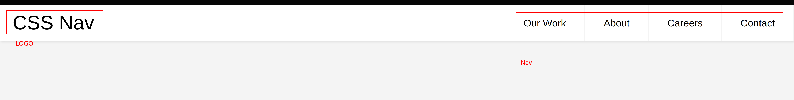

# 宗旨

運用任何 HTML、CSS 技巧，不使用任何額外的套件

# 技術重點：

## HTML

-   找到一個好的排版工具很重要

## CSS

### 置中技巧

-   類似 `index.css` 中的 `#welcome-home`，注意 `position: relative` and  `position: absolute` 之間的關係

### 文字浮在圖片上

-   `.gallery-items-title` and `.gallery-items` 的關係

### Grid System

-   [ref](https://www.w3schools.com/cssref/pr_grid.asp)

### RWD

-   要點在於先想好整體架構，再去實做，才不會改了後面結果前面不能用

### Responsive Hamburger Menu

-   將 header components 切分為：

    1.  左方的 LOGO: 使用 `display: block; float: left;`
    2.  右方的 Navigation: 細節多，看 [ref](https://codepen.io/mutedblues/pen/MmPNPG)
